# データ層（SQLite OPFS + Worker RPC）

miyulab-fe のデータ層は、ブラウザ内 SQLite（Wasm）をバックエンドとし、Web Worker 上で動作する RPC モデルで構成される。Fediverse サーバーから取得したステータス・通知などのデータをローカルに正規化して保存し、リアクティブな変更通知でUIを駆動する。

---

## 目次

1. [SQLite OPFS アーキテクチャ](#1-sqlite-opfs-アーキテクチャ)
2. [Web Worker RPC 通信モデル](#2-web-worker-rpc-通信モデル)
3. [キュー管理](#3-キュー管理)
4. [変更通知システム](#4-変更通知システム)
5. [DB スキーマ概要](#5-db-スキーマ概要)
6. [StatusStore / NotificationStore](#6-statusstore--notificationstore)
7. [次に読むべきドキュメント](#7-次に読むべきドキュメント)

---

## 1. SQLite OPFS アーキテクチャ

> ソース: `src/util/db/sqlite/worker/workerInit.ts`

### 1.1 VFS フォールバックチェーン

SQLite Wasm の初期化は 3 段階のフォールバックチェーンで行われる。上位の VFS が利用不可能な場合、自動的に次の段階にフォールバックする。

```
┌─────────────────────────────┐
│ 1. OPFS SAH Pool VFS        │  ← 最高パフォーマンス（推奨）
│    directory: /miyulab-fe    │
│    name: opfs-sahpool        │
└──────────┬──────────────────┘
           │ 失敗時
┌──────────▼──────────────────┐
│ 2. 通常 OPFS (OpfsDb)       │  ← SAH Pool 未対応ブラウザ向け
│    path: /miyulab-fe.sqlite3 │
└──────────┬──────────────────┘
           │ 失敗時
┌──────────▼──────────────────┐
│ 3. インメモリ DB (:memory:)  │  ← OPFS 非対応環境（データ非永続）
└─────────────────────────────┘
```

**OPFS SAH Pool VFS** は `SharedAccessHandle` ベースのプール化 VFS で、通常の OPFS VFS より高いスループットを実現する。`sqlite3.installOpfsSAHPoolVfs()` で有効化される。

### 1.2 OPFS（Origin Private File System）

OPFS はブラウザが提供するオリジン単位のプライベートファイルシステムである。ユーザーのファイルシステムとは分離されており、同一オリジン内のページからのみアクセス可能。SQLite の永続化ストレージとして使用する。

### 1.3 PRAGMA 設定

初期化時に以下の PRAGMA が設定される：

| PRAGMA | 値 | 目的 |
|--------|-----|------|
| `journal_mode` | `WAL` | Write-Ahead Logging で読み書きの並行性を向上 |
| `synchronous` | `NORMAL` | WAL モードでのバランスの良い耐久性 |
| `foreign_keys` | `ON` | 外部キー制約を有効化 |
| `cache_size` | `-8000` | ページキャッシュを 8MB に拡大（デフォルト 2MB） |
| `temp_store` | `MEMORY` | 一時テーブルをメモリに配置 |

### 1.4 セキュリティヘッダー要件（COOP / COEP）

OPFS SAH Pool VFS は `SharedArrayBuffer` を必要とし、これにはクロスオリジン分離が必須となる。`next.config.mjs` で以下のヘッダーが全ルートに設定されている：

> ソース: `next.config.mjs`

```javascript
headers: [
  { key: 'Cross-Origin-Embedder-Policy', value: 'credentialless' },
  { key: 'Cross-Origin-Opener-Policy',   value: 'same-origin' },
]
// source: '/:path*' — 全パスに適用
```

- **COEP `credentialless`**: クロスオリジンリソースの読み込みを制限しつつ、`require-corp` より柔軟（外部画像等に対応）
- **COOP `same-origin`**: トップレベルウィンドウを同一オリジンに分離

これらのヘッダーにより `crossOriginIsolated === true` となり、`SharedArrayBuffer` が利用可能になる。

---

## 2. Web Worker RPC 通信モデル

SQLite の全操作は専用の Web Worker 内で実行され、メインスレッドからは RPC スタイルのメッセージパッシングでアクセスする。

### 2.1 アーキテクチャ概要

```
メインスレッド                              Web Worker
┌───────────────────┐                   ┌───────────────────────┐
│ publicApi.ts      │  postMessage()    │ sqlite.worker.ts      │
│  execAsync()      │ ───────────────►  │  onmessage ルーター    │
│  sendCommand()    │                   │    ├─ handleExec       │
│  executeGraphPlan │                   │    ├─ handleExecBatch  │
│  fetchTimeline()  │                   │    ├─ workerStatusStore│
│                   │  ◄───────────────  │    ├─ workerNotif...  │
│ messageHandler.ts │  postMessage()    │    ├─ runGraphPlan     │
│  handleMessage()  │                   │    └─ runFlatFetch     │
└───────────────────┘                   └───────────────────────┘
```

> ソース:
> - Worker エントリ: `src/util/db/sqlite/worker/sqlite.worker.ts`
> - クライアント API: `src/util/db/sqlite/workerClient/publicApi.ts`
> - レスポンス処理: `src/util/db/sqlite/workerClient/messageHandler.ts`
> - プロトコル型: `src/util/db/sqlite/protocol.ts`

### 2.2 初期化フロー

1. `initWorker()` が `new Worker()` でワーカーを生成
2. メインスレッドが `{ type: '__init', origin }` を Worker に送信
3. Worker が `workerInit.ts` の `init(origin)` を実行し、VFS フォールバックチェーンで DB を初期化
4. Worker が `{ type: 'init', persistence: 'opfs' | 'memory' }` を返送
5. `messageHandler.ts` が `initResolve` を呼び出し、初期化 Promise が解決

初期化には `INIT_TIMEOUT_MS` のタイムアウトが設けられており、時間内に init メッセージが届かない場合は reject される。

### 2.3 メッセージプロトコル

> ソース: `src/util/db/sqlite/protocol.ts`

#### リクエスト型（Main Thread → Worker）

| 型名 | type | 用途 |
|------|------|------|
| `ExecRequest` | `exec` | 汎用 SQL 実行（主に SELECT） |
| `ExecBatchRequest` | `execBatch` | 複数 SQL のバッチ実行（INSERT/UPDATE/DELETE） |
| `FetchTimelineRequest` | `fetchTimeline` | タイムライン一括取得（Phase1→Phase2→Batch×8） |
| `ExecuteQueryPlanRequest` | `executeQueryPlan` | 汎用実行エンジン経由のクエリプラン実行 |
| `ExecuteGraphPlanRequest` | `executeGraphPlan` | V2 グラフエンジンによるクエリプラン実行 |
| `ExecuteFlatFetchRequest` | `executeFlatFetch` | 事前フィルタ済み ID からの Entity 組み立て |
| `UpsertStatusRequest` | `upsertStatus` | Status 1 件の upsert |
| `BulkUpsertStatusesRequest` | `bulkUpsertStatuses` | Status 複数件の一括 upsert |
| `AddNotificationRequest` | `addNotification` | Notification 1 件の追加 |
| `BulkAddNotificationsRequest` | `bulkAddNotifications` | Notification 複数件の一括追加 |

その他、`UpdateStatusActionRequest`、`HandleDeleteEventRequest`、`RemoveFromTimelineRequest`、`EnsureLocalAccountRequest`、`ToggleReactionRequest`、`BulkUpsertCustomEmojisRequest` 等の専用コマンド型が定義されている。

#### レスポンス型（Worker → Main Thread）

| 型名 | type | 内容 |
|------|------|------|
| `SuccessResponse` | `response` | 成功結果 + `changedTables` + `changeHint` + `durationMs` |
| `ErrorResponse` | `error` | エラーメッセージ |
| `InitMessage` | `init` | 初期化完了通知（永続化方式を含む） |
| `SlowQueryLogMessage` | `slowQueryLogs` | スロークエリログ通知 |

**`changedTables`** は書き込み操作が影響を与えたテーブル名の配列で、メインスレッド側の変更通知システムを駆動する重要なフィールドである。

**`changeHint`** は変更のコンテキスト情報（`timelineType`、`backendUrl`、`tag`）を含み、スマート無効化に使用される。

### 2.4 リクエスト ID 管理

各リクエストにはインクリメンタルな `id` が付与される。Worker はレスポンスに同じ `id` を含めて返し、`messageHandler.ts` が `pending` マップから対応する Promise の `resolve` / `reject` を見つけて呼び出す。

---

## 3. キュー管理

> ソース:
> - `src/util/db/sqlite/workerClient/queueManager.ts`
> - `src/util/db/dbQueue.ts`

### 3.1 2 本のキュー

Worker はシングルスレッドでメッセージを逐次処理するため、一度に 1 つのリクエストしか処理できない。クライアント側では 2 本のキューで直列化を行う。

```
                ┌─────────────────┐
                │ otherQueue      │  書き込み・管理系（高優先度）
                │ ■ ■ ■ □ □      │
                └────────┬────────┘
                         │  processQueue()
                         ▼
                ┌─────────────────┐     postMessage()     ┌──────────┐
                │ activeRequest   │ ───────────────────► │  Worker  │
                └─────────────────┘                       └──────────┘
                         ▲
                         │  processQueue()
                ┌────────┴────────┐
                │ timelineQueue   │  タイムライン取得（低優先度）
                │ ■ ■ □ □ □      │
                └─────────────────┘
```

| キュー | 用途 | 特徴 |
|--------|------|------|
| `otherQueue` | 書き込み（upsert, delete）、管理操作 | **優先処理**。UI 応答性を確保 |
| `timelineQueue` | タイムライン取得クエリ | 重複排除あり、Stale キャンセル対応 |

### 3.2 分離の理由

- **書き込み優先**: ストリーミングイベントの書き込みが滞ると通知の遅延やデータロスに繋がるため、other キューを優先的に処理する
- **重複排除**: タイムラインの読み取りクエリは同一クエリ（SQL + bind + returnValue）が未処理の場合、新規追加せず既存リクエストの結果を共有する
- **飢餓防止**: `maxConsecutiveOther` 制御により、other キューの連続処理回数を制限し、timeline キューの飢餓（スターベーション）を防止する

### 3.3 優先度プリセット

> ソース: `src/util/db/dbQueue.ts`

`maxConsecutiveOther` は 4 つのプリセットで制御可能：

| プリセット | maxConsecutiveOther | 用途 |
|-----------|---------------------|------|
| `auto` | キュー比率に応じて 1〜8 | デフォルト。動的に最適化 |
| `balanced` | 2 | タイムライン更新を重視 |
| `default` | 4 | 標準バランス |
| `other-first` | 8 | 書き込み・管理操作優先 |

`auto` モードでは `otherQueue.length / timelineQueue.length` の比率に基づく適応テーブルで `maxConsecutiveOther` を動的に算出する。

### 3.4 タイムラインキューの重複排除と Stale キャンセル

- **重複排除**: `makeTimelineDedupKey()` が SQL + bind + returnValue からキーを生成。同一キーのリクエストが待機中なら新規追加せず、既存リクエストの Promise を共有（`sharedResolve` / `sharedReject`）
- **sessionTag 付きリクエスト**: dedup をスキップし、同じ sessionTag のキュー内アイテムを**インプレース置換**する。末尾追加パターンで発生するスターベーションを防止
- **`cancelStaleRequests()`**: 指定した sessionTag の未処理アイテムをキューから除去し、staleValue で即時 resolve

### 3.5 タイムアウト

各リクエストには `TIMEOUT_MS` のタイムアウトが設定される。タイムアウトはリクエストが Worker に実際に送信された時点から計測される（キュー待ち時間を含まない）。

---

## 4. 変更通知システム

> ソース: `src/util/db/sqlite/connection.ts`

### 4.1 概要

変更通知システムは、DB 書き込み後に React Hook を再クエリさせるためのパブリッシュ・サブスクライブ機構である。

```
Worker 書き込み完了
     │  changedTables: ['posts', 'timeline_entries']
     │  changeHint: { timelineType: 'home', backendUrl: '...' }
     ▼
messageHandler.ts
     │  notifyChangeCallback(table, enrichedHint)
     ▼
connection.ts — notifyChange(table, hint)
     │  80ms debounce
     ▼
pendingByTable (Map<TableName, PendingEntry>)
     │  蓄積
     ▼
flushNotifications()
     │  テーブルごとにリスナーへ hints[] を配信
     ▼
React Hook (subscribe 経由) → 再クエリ
```

### 4.2 テーブル別ヒント蓄積

`pendingByTable: Map<TableName, PendingEntry>` がテーブルごとに変更ヒントを蓄積する。

```typescript
type PendingEntry = {
  hints: ChangeHint[]           // debounce 期間中に蓄積されたヒント
  hasHintlessChange: boolean    // hint なしの変更が 1 回でもあった場合 true
}
```

### 4.3 ChangeHint の概念

`ChangeHint` は変更のコンテキスト情報を表す型で、スマート無効化（不要な再クエリの抑制）に使用される。

```typescript
type ChangeHint = {
  timelineType?: string       // 'home' | 'local' | 'public' | 'tag'
  backendUrl?: string         // 変更が発生したバックエンド URL
  tag?: string                // 関連するハッシュタグ
  changedTables?: readonly string[]  // 書き込みバッチで変更された全テーブル名
}
```

Hook 側で hints を検査し、自パネルに関係する変更かどうかを判定して不要な再クエリを抑制できる。

### 4.4 hintless 変更の追跡

`hasHintlessChange` フラグは、hint なしの `notifyChange()` が 1 回でも呼ばれた場合に `true` になる。ユーザーの手動操作（mute/block 等）では変更元のコンテキストが不明なため、hint なしで通知される。

フラッシュ時の動作：
- `hasHintlessChange === true` → 空配列 `[]` をリスナーに渡す → **全サブスクライバーが再取得**
- `hasHintlessChange === false` → 蓄積された `hints[]` を渡す → サブスクライバーが選択的に再取得

### 4.5 debounce（80ms）

ストリーミングのバースト（数十 ms 間隔で複数テーブルが変更される）を吸収し、リスナーの発火回数を削減する。80ms の debounce 間隔は、バースト吸収とユーザー操作のフィードバック遅延のバランスを取った値。

### 4.6 WrittenTableCollector

> ソース: `src/util/db/sqlite/protocol.ts`

```typescript
type WrittenTableCollector = Set<TableName>
```

Worker 側の各書き込みハンドラが変更したテーブル名を `Set<TableName>` に収集する。レスポンスの `changedTables` フィールドとして返され、メインスレッド側の変更通知を駆動する。

---

## 5. DB スキーマ概要

> ソース: `src/util/db/sqlite/schema/`

スキーマは FK 依存順に作成される。`ensureSchema()` が Worker 起動時に呼ばれ、マイグレーションシステムを通じてスキーマを初期化・更新する。

現在のスキーマバージョン: **2.0.5**（`src/util/db/sqlite/schema/version.ts`）

### 5.1 ディレクトリ構成

```
src/util/db/sqlite/schema/
├── index.ts          # ensureSchema / createFreshSchema / dropAllTables
├── types.ts          # DbExec 型定義
├── version.ts        # セマンティックバージョニング (LATEST_VERSION: 2.0.5)
└── tables/
    ├── lookup.ts       # servers, visibility_types, media_types, notification_types, card_types, muted_accounts, blocked_instances
    ├── registries.ts   # custom_emojis, hashtags
    ├── profiles.ts     # profiles, profile_stats, profile_fields, profile_custom_emojis
    ├── accounts.ts     # local_accounts
    ├── posts.ts        # posts, post_backend_ids, post_stats
    ├── postRelated.ts  # post_media, post_mentions, post_hashtags, post_custom_emojis
    ├── interactions.ts # post_interactions, post_emoji_reactions
    ├── polls.ts        # polls, poll_votes, poll_options
    ├── cards.ts        # link_cards
    ├── timeline.ts     # timeline_entries
    ├── notifications.ts# notifications
    └── meta.ts         # schema_version
```

### 5.2 テーブル関係図（FK 依存順）

```mermaid
erDiagram
    servers ||--o{ local_accounts : "server_id"
    servers ||--o{ profiles : "server_id"
    servers ||--o{ posts : "origin_server_id"
    servers ||--o{ custom_emojis : "server_id"
    servers ||--o{ muted_accounts : "server_id"

    profiles ||--o{ local_accounts : "profile_id"
    profiles ||--o{ posts : "author_profile_id"
    profiles ||--o{ profile_stats : "profile_id"
    profiles ||--o{ profile_fields : "profile_id"
    profiles ||--o{ profile_custom_emojis : "profile_id"
    profiles ||--o{ notifications : "actor_profile_id"

    local_accounts ||--o{ post_backend_ids : "local_account_id"
    local_accounts ||--o{ post_interactions : "local_account_id"
    local_accounts ||--o{ timeline_entries : "local_account_id"
    local_accounts ||--o{ notifications : "local_account_id"
    local_accounts ||--o{ poll_votes : "local_account_id"

    posts ||--o{ post_backend_ids : "post_id"
    posts ||--o{ post_stats : "post_id"
    posts ||--o{ post_media : "post_id"
    posts ||--o{ post_mentions : "post_id"
    posts ||--o{ post_hashtags : "post_id"
    posts ||--o{ post_custom_emojis : "post_id"
    posts ||--o{ post_interactions : "post_id"
    posts ||--o{ post_emoji_reactions : "post_id"
    posts ||--o{ polls : "post_id"
    posts ||--o{ link_cards : "post_id"
    posts ||--o{ timeline_entries : "post_id"
    posts ||--o{ notifications : "related_post_id"
    posts ||--o{ posts : "reblog_of_post_id"
    posts ||--o{ posts : "quote_of_post_id"

    visibility_types ||--o{ posts : "visibility_id"
    media_types ||--o{ post_media : "media_type_id"
    notification_types ||--o{ notifications : "notification_type_id"
    card_types ||--o{ link_cards : "card_type_id"

    custom_emojis ||--o{ post_custom_emojis : "custom_emoji_id"
    custom_emojis ||--o{ profile_custom_emojis : "custom_emoji_id"
    hashtags ||--o{ post_hashtags : "hashtag_id"

    polls ||--o{ poll_options : "poll_id"
    polls ||--o{ poll_votes : "poll_id"
```



### 5.3 コアテーブル一覧

#### ルックアップテーブル（`tables/lookup.ts`）

| テーブル | 説明 | 主なカラム |
|----------|------|-----------|
| `servers` | サーバー（インスタンス）マスタ | `id`, `host` (UNIQUE) |
| `visibility_types` | 公開範囲の定数テーブル | public, unlisted, private, direct, local |
| `media_types` | メディア種別の定数テーブル | unknown, image, gifv, video, audio |
| `notification_types` | 通知種別の定数テーブル | follow, favourite, reblog, mention 等 19 種 |
| `card_types` | カード種別の定数テーブル | link, photo, video, rich |
| `muted_accounts` | ミュート中のアカウント | `server_id`, `account_acct`, `muted_at` |
| `blocked_instances` | ブロック中のインスタンス | `instance_domain`, `blocked_at` |

#### レジストリテーブル（`tables/registries.ts`）

| テーブル | 説明 | 主なカラム |
|----------|------|-----------|
| `custom_emojis` | カスタム絵文字マスタ | `shortcode`, `server_id`, `url`, `static_url`, `category` |
| `hashtags` | ハッシュタグマスタ | `name` (UNIQUE), `url` |

#### プロフィールテーブル（`tables/profiles.ts`）

| テーブル | 説明 | 主なカラム |
|----------|------|-----------|
| `profiles` | ユーザープロフィール | `actor_uri`, `username`, `acct`, `canonical_acct`, `avatar_url` 等 |
| `profile_stats` | プロフィール統計 | `followers_count`, `following_count`, `statuses_count` |
| `profile_fields` | プロフィールフィールド | `name`, `value`, `verified_at` |
| `profile_custom_emojis` | プロフィール×絵文字の中間テーブル | `profile_id`, `custom_emoji_id` |

#### アカウントテーブル（`tables/accounts.ts`）

| テーブル | 説明 | 主なカラム |
|----------|------|-----------|
| `local_accounts` | ローカルに登録したアカウント | `server_id`, `backend_url`, `backend_type`, `acct`, `remote_account_id`, `access_token`, `profile_id` |

#### 投稿テーブル（`tables/posts.ts`）

| テーブル | 説明 | 主なカラム |
|----------|------|-----------|
| `posts` | 投稿の本体 | `object_uri`, `author_profile_id`, `content_html`, `created_at_ms`, `visibility_id`, `reblog_of_post_id`, `quote_of_post_id` 等 |
| `post_backend_ids` | 投稿のバックエンド別ローカル ID マッピング | `post_id`, `local_account_id`, `local_id` (UNIQUE per account) |
| `post_stats` | 投稿統計 | `replies_count`, `reblogs_count`, `favourites_count`, `emoji_reactions_json` |

`post_backend_ids` は、同一の投稿（`object_uri` で一意）が複数のバックエンドで異なるローカル ID を持つことに対応するための中間テーブルである。

#### 投稿関連テーブル（`tables/postRelated.ts`）

| テーブル | 説明 | 主なカラム |
|----------|------|-----------|
| `post_media` | メディア添付 | `post_id`, `media_type_id`, `url`, `width`, `height`, `blurhash` 等 |
| `post_mentions` | メンション | `post_id`, `acct`, `username`, `url` |
| `post_hashtags` | 投稿×ハッシュタグの中間テーブル | `post_id`, `hashtag_id` |
| `post_custom_emojis` | 投稿×絵文字の中間テーブル | `post_id`, `custom_emoji_id` |

#### インタラクションテーブル（`tables/interactions.ts`）

| テーブル | 説明 | 主なカラム |
|----------|------|-----------|
| `post_interactions` | ユーザーの投稿に対する操作状態 | `post_id`, `local_account_id`, `is_favourited`, `is_reblogged`, `is_bookmarked`, `my_reaction_name` 等 |
| `post_emoji_reactions` | 投稿のリアクション集計 | `post_id`, `name`, `count` |

#### タイムラインテーブル（`tables/timeline.ts`）

| テーブル | 説明 | 主なカラム |
|----------|------|-----------|
| `timeline_entries` | タイムラインのエントリ | `local_account_id`, `timeline_key`, `post_id`, `display_post_id`, `created_at_ms` |

`timeline_key` はタイムラインの種類を表す文字列（`home`, `local`, `public`, `tag:xxx` 等）。`display_post_id` はリブログの場合に元の投稿を指す。

#### 通知テーブル（`tables/notifications.ts`）

| テーブル | 説明 | 主なカラム |
|----------|------|-----------|
| `notifications` | 通知 | `local_account_id`, `local_id`, `notification_type_id`, `created_at_ms`, `actor_profile_id`, `related_post_id`, `reaction_name` 等 |

#### 投票テーブル（`tables/polls.ts`）

| テーブル | 説明 | 主なカラム |
|----------|------|-----------|
| `polls` | 投票本体 | `post_id` (UNIQUE), `expires_at`, `multiple`, `votes_count` |
| `poll_options` | 投票選択肢 | `poll_id`, `sort_order`, `title`, `votes_count` |
| `poll_votes` | ユーザーの投票状態 | `poll_id`, `local_account_id`, `voted`, `own_votes_json` |

#### リンクカードテーブル（`tables/cards.ts`）

| テーブル | 説明 | 主なカラム |
|----------|------|-----------|
| `link_cards` | OGP リンクカード | `post_id` (UNIQUE), `card_type_id`, `url`, `title`, `description`, `image` 等 |

#### メタテーブル（`tables/meta.ts`）

| テーブル | 説明 | 主なカラム |
|----------|------|-----------|
| `schema_version` | スキーマバージョン管理 | `version`, `applied_at`, `description` |

---

## 6. StatusStore / NotificationStore

### 6.1 StatusStore（書き込み操作）

> ソース: `src/util/db/sqlite/stores/statusStore.ts`

StatusStore は Fediverse API から取得した Status（投稿）を DB に書き込む操作を提供する。全ての書き込みは Worker 側の専用ハンドラに委譲される。

#### 主要 API

| 関数 | 説明 |
|------|------|
| `upsertStatus()` | 1 件の Status を追加/更新（マイクロバッチング対応） |
| `bulkUpsertStatuses()` | 複数 Status を一括追加（初期ロード用） |
| `updateStatusAction()` | アクション状態の更新（favourite / reblog / bookmark） |
| `updateStatus()` | 編集された投稿の全体更新 |
| `handleDeleteEvent()` | delete イベント処理 |
| `removeFromTimeline()` | 特定タイムラインから除外 |
| `ensureLocalAccount()` | ローカルアカウントの登録/更新 |
| `toggleReactionInDb()` | リアクションの追加/削除 |
| `bulkUpsertCustomEmojis()` | カスタム絵文字カタログの一括登録 |

#### マイクロバッチング

ストリーミングイベント（WebSocket 経由）は高頻度で到着するため、個別トランザクションを避けてバッファリングする：

```
ストリーミングイベント到着
     │
     ▼
upsertBufferMap (Map<key, BufferedUpsert[]>)
     │  バッファキー = backendUrl + timelineType + tag
     │
     ├─ 100ms 経過 → flushAllBuffers() → bulkUpsertStatuses
     │
     └─ 20件到達 → 即座に flushAllBuffers() → bulkUpsertStatuses
```

- **`FLUSH_INTERVAL_MS = 100`**: 100ms ごとにバッファをフラッシュ
- **`FLUSH_SIZE_THRESHOLD = 20`**: 20 件に達したら即座にフラッシュ

### 6.2 NotificationStore（書き込み・読み取り操作）

> ソース: `src/util/db/sqlite/notificationStore.ts`

NotificationStore は通知の書き込みと読み取りを提供する。書き込みは Worker に委譲し、読み取りは `execAsync` で直接クエリを実行する。

#### 主要 API

| 関数 | 説明 |
|------|------|
| `addNotification()` | 1 件の Notification を追加 |
| `bulkAddNotifications()` | 複数の Notification を一括追加 |
| `getNotifications()` | 通知の取得（backendUrl / localAccountId でフィルタ可能） |
| `updateNotificationStatusAction()` | 通知内 Status のアクション状態更新 |
| `rowToStoredNotification()` | 正規化テーブルの行配列を `Entity.Notification` に変換 |

#### Worker 側の通知処理

> ソース: `src/util/db/sqlite/worker/workerNotificationStore.ts`

Worker 側では以下の処理が行われる：

1. `notification_types` の定数マップ（19 種）でタイプ ID を解決（DB ルックアップ不要）
2. `ensureServer()` / `ensureProfile()` でサーバー・プロフィールを取得または作成
3. 関連投稿が存在しない場合は `ensurePostForNotification()` で投稿を挿入
4. `notifications` テーブルに `INSERT OR REPLACE`
5. 変更されたテーブル名を `WrittenTableCollector` で収集して返送

### 6.3 バルク操作パターン

StatusStore と NotificationStore に共通するバルク操作のパターン：

1. **メインスレッド**: Entity の JSON 配列を `sendCommand()` で Worker に送信
2. **Worker**: JSON をパースし、トランザクション内で一括処理
3. **Worker**: `WrittenTableCollector (Set<TableName>)` で変更テーブルを収集
4. **Worker**: `sendResponse()` で結果 + `changedTables` + `changeHint` を返送
5. **メインスレッド**: `messageHandler.ts` が `changedTables` を元に `notifyChangeCallback` を発火
6. **メインスレッド**: `connection.ts` の debounce 経由でリスナーに通知

---

## 7. 次に読むべきドキュメント

- **[`04-query-ir.md`](./04-query-ir.md)** — クエリ IR（中間表現）システム。ExecutionPlan / GraphPlan / FlatFetch の設計と、ID 収集→マージ→詳細取得→バッチエンリッチの実行パイプラインについて解説する。
