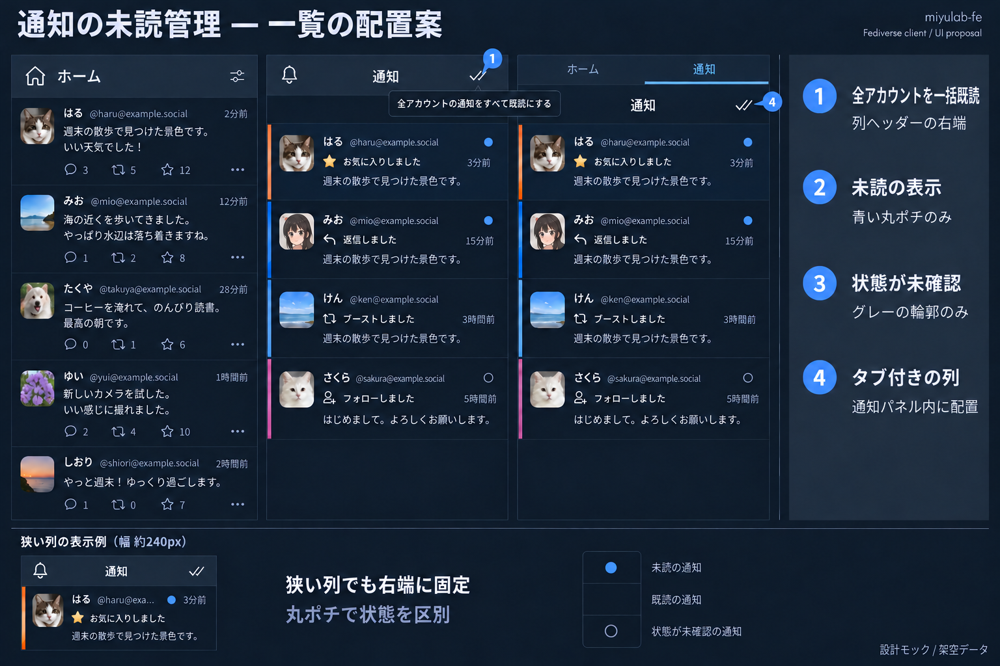
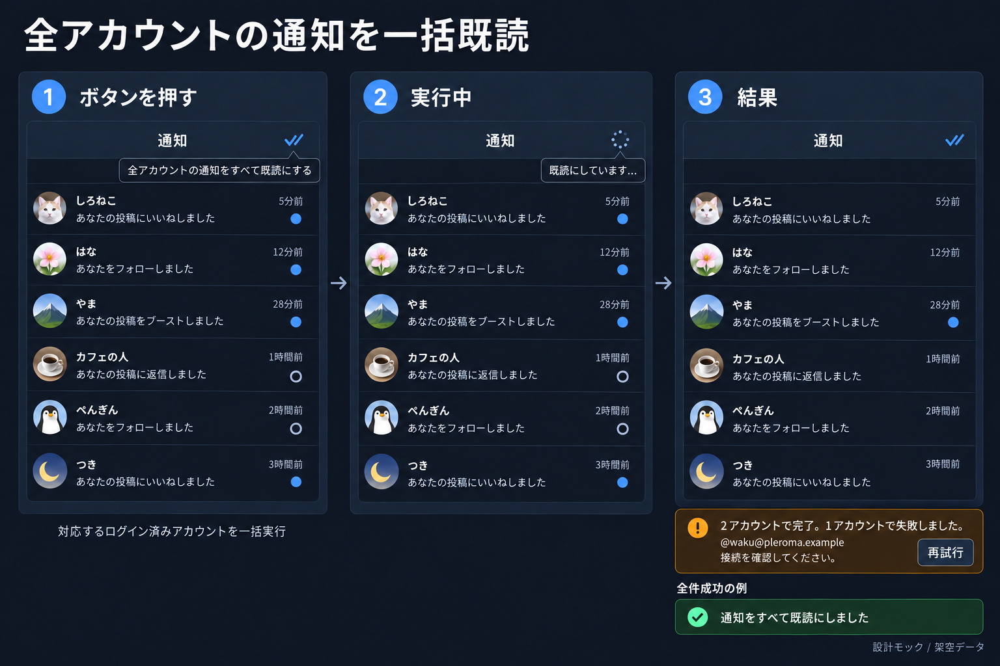

# 通知の未読管理 API 連携

設計日: 2026-10-09。調査対象: `861c9c5`、megalodon 10.3.0、misskey-js 2026.10.0。

## 操作

「全件既読」ボタンを押すと、対応するログイン済みの全アカウントで通知を一括既読にする。対象選択・確認ダイアログは設けない。押した列のフィルタに関係なく、非表示・未取得の通知も対象とする。

列を開く、スクロールする、通知を取得するだけでは既読にしない。API成功後にSQLiteへ保存し、同じアカウントを表示するすべての列へ反映する。

## UI

### 配置

- **ボタン:** 通知列・混合列のヘッダー右端にcheck-checkアイコン。説明とaccessible nameは「全アカウントの通知をすべて既読にする」。タブ付き列ではタブバーの下のパネルヘッダーに置く。
- **未読:** 行右上に直径8pxの青い丸ポチ。既読は表示なし、未確認は同じ大きさのグレーの輪郭だけ。行内の状態テキストと背景の強調は付けない。通知種別の既存のボーダー色は維持する。
- 状態は読み上げ用のラベルで伝える。
- ヘッダーの先頭スクロール用ボタンとは分ける。操作領域はデスクトップで最低24px、タッチ端末で最低44px。狭い列でもアイコンと丸ポチを表示する。

### 実行と結果

- **実行中:** 全列の既読ボタンを無効化し、spinnerと「既読にしています…」を表示する。対応する認証済みアカウントが0件なら実行不可。
- **成功:** 既存の通知表示で「通知をすべて既読にしました」。通常の通知列では行を残し、未読フィルタ付きの列では該当行を除く。
- **一部失敗:** 完了・失敗件数、失敗したアカウントと理由、「再試行」を表示する。再試行は失敗分だけを対象にする。
- **非対応:** 対象から除き、結果に非対応件数を表示する。
- 結果は `aria-live` で伝える。API成功前に行を既読表示にしない。未読件数バッジは追加しない。

画像は配置のイメージ。実装は既存のUI部品・余白・ヘッダー構造に合わせる。[生成条件](design/notification-read-ui/prompts.md)。

## バックエンド

| バックエンド | 全件既読 | 状態の同期 |
| --- | --- | --- |
| Mastodon | フィルタなしの最新通知IDを取得し、`saveMarkers({ notifications: { last_read_id } })` | `getMarkers(['notifications'])` |
| Pleroma | フィルタなしの最新通知IDを取得し、`readNotifications({ max_id })` | 通知の `pleroma.is_seen`。応答は最大80件 |
| Misskey | `notifications/mark-all-as-read` | `unreadNotification` で該当IDを未読、`/api/i` の未読なしで取得済み行を既読。それ以外は未確認 |
| Firefish / GoToSocial / Pixelfed / Friendica | 初回は非対応 | 実サーバーの仕様確認後に対応 |

Mastodon/Pleromaは最新IDを取得した時点まで、Misskeyはサーバーの処理時点の全件が対象となる。通知を消すclear/dismiss APIへ置き換えない。

## データと同期

- `notifications.is_read` を `NULL = 未確認 / 0 = 未読 / 1 = 既読` にし、共通の通知変換から `isRead: boolean | null` を返す。
- `local_accounts.notification_last_read_id TEXT NULL` にMastodonのmarkerとPleromaの成功した境界を保存する。Misskeyは状態確認前のキャッシュ内通知IDを固定し、`/api/i` の `hasUnreadNotification === false` を確認できた場合だけ、そのID群を既読にする。確認後の新着・後から取得した履歴は対象にしない。
- 移行では通知本体・PK・参照を維持し、既存の既読フラグを未確認にしてAPIから同期する。Query IRのnullable定義も更新する。`is_read = 0` は未確認行を含まない。
- APIのIDは文字列で保持する。SQLiteのPKや投稿IDを送らず、アカウントをまたいで比較しない。十進IDは精度を保って比較し、順序不明の行は未確認とする。
- PleromaのSDK変換は `is_seen` を落とすため、rawの補助GETからIDで既読状態を突き合わせる。初回・ページ追加・欠損Status補完を同じ経路にする。IDが一致しない場合は既知状態を保持する。
- Misskeyの通知取得・欠損補完は `markAsRead: false` とする。
- 起動・ストリーム再接続・可視タブへの復帰・手動再取得で同期する。既存の集中管理ストリームでMisskeyの `unreadNotification` と `readAllNotifications` も受け、後者は状態確認のきっかけにする。状態同期の失敗で通常の通知取得を止めない。
- Misskeyの全件既読APIは処理完了を待たず応答する。正常応答後に状態を確認し、5秒以内に未読なしを確認できなければ「既読操作は受付済み・状態を確認できませんでした」と表示する。再試行は状態確認だけにする。新着がある場合も完了を推測しない。
- 通知UPSERTで既知の既読を、遅れて届いた未読・未確認で戻さない。

## 実行と反映

1. 操作開始時の対応する認証済みAppを固定し、重複実行を抑止する。現在のトークンによる本人確認IDを `local_accounts.remote_account_id` と照合し、`backendUrl` の解決先が一致しない場合は実行しない。ログアウト・再認証後に古い応答を適用しない。
2. バックエンド別にAPIを実行する。最新IDは未知の通知種別も落とさないraw応答から取得する。通知0件なら書き込み不要。markerの後退を防ぎ、409は再取得後に1回だけ再試行する。空のmarker保存応答は成功にしない。
3. 成功したアカウントだけ、既存の書き込みlaneとWorker経由でmarker・通知をトランザクション更新する。すべての更新に `local_account_id` 条件を付ける。
4. Worker・fallbackの両方で `changedTables` と `backendUrl` のhintを返す。既読変更を表す理由はcoalescer・実行中・scrollback中の保留でも維持する。
5. 既読変更では最新カーソルを使わず、保持中の件数＋1ページで元のQueryPlanを再評価して置換する。未読条件から外れた行を取り除き、スクロールアンカーを保つ。再評価失敗時は表示データを残す。
6. API失敗でローカルを成功状態にしない。タイムアウトは状態を再取得する。API成功後のDB失敗は「サーバー反映済み・表示の同期に失敗しました」と表示し、再試行では同期だけを行う。

## 実装範囲と確認

API処理、通知取得の3経路、通知の型・schema・migration・Query IR、通知ストア、Worker protocol/dispatch/public API/fallback、リストの再評価、通知行とヘッダーを更新する。

確認するケースは全アカウント一括実行、部分成功・非対応・再試行、二重クリック、操作中の新着・再認証・本人確認ID不一致、Pleromaの80件超、Misskey取得時の既読抑止・未読イベント・完了確認不可、未読フィルタとscrollback、Worker/fallbackの一致、migrationでの通知保持。`yarn check`、`yarn typecheck`、関連テスト、`git diff --check` を実行する。

## 一次資料

- [Mastodon markers](https://docs.joinmastodon.org/methods/markers/)、[Marker](https://docs.joinmastodon.org/entities/Marker/)
- [Pleroma read API](https://docs.pleroma.social/backend/development/API/pleroma_api/#apiv1pleromanotificationsread)、[is_seen](https://docs.pleroma.social/backend/development/API/differences_in_mastoapi_responses/#notifications)
- [Misskey通知取得](https://github.com/misskey-dev/misskey/blob/develop/packages/backend/src/server/api/endpoints/i/notifications.ts)、[全件既読](https://github.com/misskey-dev/misskey/blob/develop/packages/backend/src/server/api/endpoints/notifications/mark-all-as-read.ts)、[通知イベント](https://github.com/misskey-dev/misskey/blob/develop/packages/backend/src/core/NotificationService.ts)、[アカウントの未読状態](https://github.com/misskey-dev/misskey/blob/develop/packages/backend/src/core/entities/UserEntityService.ts)

実装済み。ローカルの架空Mastodon/Pleromaで、全件既読・全列への反映・未読フィルタ・二重操作抑止・部分失敗と失敗分だけの再試行・スクロール中の行保持を確認。実サーバーでの検証は未実施。
