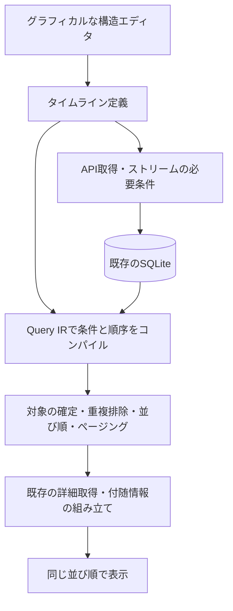

# タイムラインエディタ・生成処理の再設計案

作成日: 2026-10-06。設計提案であり、アプリの実装変更は含まない。

## 現時点のカバー範囲（UI案の照合結果）

**最新のハッシュタグUI画像は「一つの投稿集合の条件編集」の案であり、既存エディタ全体の代替設計としては未完成。** 画像上の「関連する通知・投稿の条件」ボタンは入口だけで、相関検索や混在出力を設計済みとは数えない。以下は現在のコード・プリセット・編集パネルとの照合であり、利用者がブラウザに保存している全設定を確認したものではない。

| 既存の用途・能力 | 最新の画像での扱い | 必要な追加設計 |
|---|---|---|
| 複数タグとメディア・言語をAND/ORで組み合わせる | 表現例あり | タグ全一致、さらに深い入れ子等の編集操作を確定 |
| 本文・公開範囲・日時・各種状態等の列条件 | 一部の条件だけ表示 | 現行の選択可能な項目・比較演算子に対応する詳細条件選択 |
| Home/Local/Public所属、複数アカウントでの範囲指定 | アカウント表示のみ | 集合ごとの対象範囲と、外部からの収集元を分けた操作 |
| 通知だけを表示 | 投稿に固定されている | 通知を対象とする集合 |
| 空中リプライ候補と起点通知を混在表示 | 未表現 | 関連投稿集合と起点通知集合を出力へ合流 |
| 起点ごとの前後時間窓、近い/遠いN件 | 入口のみ | 起点の参照、対応関係、選択件数、絞り込みと順位付けの順序 |
| 別集合の結果をIN/NOT INで参照・再利用 | 未表現 | 名前付き集合と型の合う参照、共通部分・差集合・多段関係 |
| 関連データの存在・不存在・件数比較 | 一部の存在条件だけ表示 | 「ある／ない／N件以上」等の関連条件 |
| 同一人物の複数バックエンドIDの照合 | 未表現 | 人物照合とアカウント範囲を区別する設定 |
| 時刻の選択、昇順/降順、途中で明示指定した件数 | 全体の投稿日時降順のみ | 全体ページサイズと意味のある集合内の選択を区別 |

根拠は `flowPresets.ts` の通知・複合・空中リプライプリセット、`FilterConditionRow.tsx` の上流参照、`ExistsConditionRow.tsx` の存在/件数、`LookupRelatedPanel.tsx` の人物照合・時間窓・perLimit、`MergePanelV2.tsx` の集合操作、`OutputPanelV2.tsx` の方向・件数。なお、`AggregateMode` のMIN/MAXや明示的な中間表経由resolveなどはIRに定義があるが、現行パネルですべて直接作成可能という意味ではない。保存済みプランの互換性として別に確認する。

全体の編集モデルは、次の3層に補う必要がある。

1. **集合を作る**: 投稿集合・通知集合などを作り、最新画像のような入れ子の条件で絞る。
2. **集合の関係を作る**: 起点の通知ごとに人物・時間を対応付けて投稿を選ぶ、別集合を参照する。対応の単位を保持する。
3. **表示を組み合わせる**: 表示する集合を選び、合流・除外・重複排除・全体の順序とページングを定義する。

例えば「A＝タグ付き投稿」「B＝自分へのリアクション通知」「C＝Bそれぞれの通知後3分以内の同じ人物の投稿」を作り、表示対象をA/B/Cから選べる構造とする。BはCの起点としてだけ使うことも、通知そのものを表示することもできる。SQL入力なしで、各集合の内側は入れ子の枠、集合間の参照は名前と接続表示で示す。常にすべてを平坦なノード列へ展開する必要はない。

現行で意味を持つ操作の対応表、既存プリセットの操作手順、複合例の結果同値性が揃うまで「全用途をカバー」とは扱わない。旧エディタを保持することは設定保護策であり、新UIの表現力を満たした証明にはならない。登録順依存や不適切な先行LIMITによる欠落は互換対象にしないが、利用者が意図して指定した「各起点の最初のN件」等は保持する。

## 推奨する方向

**投稿・通知を主語にしたグラフィカルな構造エディタを標準UIにし、保存する「タイムラインの定義」と実行時のSQL・取得計画を分離する。**

設定画面の主役は、入力・関連検索・条件・分岐・合流・表示を表すブロックと矢印とする。利用者からのフィードバックを受け、フォームを縦に並べる初案を改めた。各ブロックは「自分への通知」「通知した人の投稿」「通知のあと3分以内」のような意味を表し、SQLやDBテーブル名は要求しない。選択したブロックの詳細だけを補助パネルで編集する。

通常の追加操作は接続先を指定してブロックを挿入し、自動配置する。高度な分岐・合流も図で確認できるようにし、グラフ全体と条件セットの参照関係を隠さない。

SQLite、Worker、既存のテーブル、詳細取得と付随情報の組み立ては再利用する。全面的なDB再設計、新しい状態管理ライブラリ、汎用クエリ最適化エンジンは前提にしない。

## 現在の問題と根拠

### 並び順だけでなく、選ばれる投稿が間違う

スクリーンショットの構成は、概ね次の経路になる。

```text
hashtags → post_hashtags の post_id → 投稿を表示
```

`compileGetIds` は時刻カラムがない場合、`0 AS created_at_ms` と `ORDER BY rowid DESC` を生成する。さらにグラフ実行は最終出力の件数を各 GetIds に渡す。このため、最終表示前に「最近DBに登録した関連行」が候補として選ばれ、投稿日時の新しい投稿が候補から落ちうる。

同じ生成SQLの形を Node.js のインメモリSQLiteで確認した最小例:

| 投稿 | 投稿日時の相対値 | 中間テーブルへの登録順 |
|---|---:|---:|
| A | 300（最新） | 1 |
| B | 200 | 2 |
| C | 100（最古） | 3 |

上限2件では現在の経路は C・B を選ぶ。表示時に投稿日時で再ソートしても B・C にしかならず、正解の A・B には戻らない。長時間の利用で登録順と投稿順が近づくことはあっても、遅れて届く投稿や履歴取得で再発する。

関連コード:

- `src/util/db/query-ir/executor/getIdsExecutor.ts`: 時刻がない場合の0・rowidフォールバック、SQLのLIMIT。
- `src/util/db/query-ir/executor/graphExecutor.ts`: Outputのlimitを各GetIdsへ渡す。
- `src/util/db/query-ir/executor/outputExecutor.ts`: 渡された候補の時刻でソート・ページング。
- `src/util/db/query-ir/patchPlanForFetch.ts`: postsへの時刻JOINはカーソル付き取得の分岐で付与される。初回取得と意味が揃わない。
- `src/app/_components/FlowEditor/FlowQueryEditorModal.tsx`: プレビューはグラフを直接実行するため、取得フックだけの修正では不十分。

通常のタグ設定を変換する `configToQueryPlanV2.ts` には、すでに posts を主語にしてハッシュタグの存在条件を付ける経路がある。これを共通化する方向が最小の出発点になる。

### 設計上、同時に整理したい点

1. **検索途中の件数と表示件数が混在している。** 途中を50件にしてから絞り込んでも、条件を満たす最新50件にはならない。共通部分や関連検索でも同様。
2. **時刻の意味が一つの数値に押し込まれている。** 投稿時刻、通知時刻、関連検索の起点時刻、中間テーブルの時刻を区別する必要がある。
3. **実行結果と表示リストの並び順が別々に決まる。** reducerは詳細エンティティの時刻で降順に再ソートする。出力側だけでASCや別の時刻を指定しても統一できない。
4. **収集設定と表示条件が分離したまま同期していない。** 初回タグ取得・タグストリームは主に `tagConfig` を参照し、任意グラフのハッシュタグ条件を同じ意味で扱わない。
5. **変更購読の依存関係が限定的。** `queryPlanV2ReferencedTables` は主にGetIds・Lookupの表を収集し、条件の内側や時刻JOINまで一律にたどらない。

## UI案の比較

| 案 | 利点 | 課題 | 判断 |
|---|---|---|---|
| 現行ノードUIの改善 | 既存利用者が移りやすく、任意の経路を表せる | テーブル・ID・中間集合の知識が必要。実行順と条件の意味を混同しやすい | 既存設定の互換編集用に残す |
| 単純な条件フォーム | タグ、本文、メディアなどを簡単に作れる | 通知と投稿をまたぐ時間条件、起点ごとの1件、混合出力を表しにくい | 単独では要件不足 |
| **意味を表すブロック＋分岐・合流＋詳細パネル** | 通常条件から空中リプライまで、つながりと構造を図で確認できる | 相関の単位とデータの種類を明示する必要がある | **推奨** |

画面上部の広い領域を構造キャンバス、下部を選択ブロックの詳細と表示プレビューにする。通知・投稿を色とラベルで区別し、矢印には流れる対象を表示する。色だけに意味を依存させない。条件追加は検索付きの選択肢、グループ化は「すべて／いずれか／除外」、並べ替えや接続先の指定はキーボードでも操作可能にする。ドラッグや配線だけを唯一の操作方法にしない。

空中リプライの図では、主経路を「自分への通知 → 通知した人の投稿 → 通知のあと3分以内 → まとめる → 新しい順に表示」とする。元の通知は時間条件を通らない別の線で「まとめる」に接続する。関連検索と時間条件を「それぞれの通知について」の枠で囲み、通知ごとの対応関係が保持されることを示す。時間条件の詳細には通知時刻からの範囲を図示し、範囲内外の投稿を見分けられるようにする。

以下の文字による設定例は、ブロックが保持する項目の説明であり、フォーム中心の画面レイアウトを指定するものではない。

### ハッシュタグの例

```text
表示するもの   投稿
対象           選択したアカウントから取得した投稿

条件           すべて満たす
                 ハッシュタグが [ごちそうフォト] を含む
                 [＋ 条件を追加]

並び順         投稿日時が新しい順
1ページ        50件

データ取得     このタグの投稿を選択したアカウントで取得
```

利用者は `hashtags` や `post_hashtags` を選ばない。複数タグの「どれかを含む／すべて含む」、メディア、言語、本文などを組み合わせられる。

プレビューは実表示と同じコンパイル・実行経路を使い、各アイテムについて「このタグに一致」「この通知から42秒後」などの表示理由を確認できるようにする。全件数の常時計算は必須にしない。

### 空中リプライの例

現行V2プリセットを基準にした例:

```text
起点           自分への通知
通知の種類     お気に入り／リアクション／ブースト
受信アカウント 選択したアカウント

関連するもの   投稿
人物の関係     投稿者が、その通知を送った人と同じ
時間の関係     通知時刻から0〜3分後
起点ごとの件数 条件に一致するすべて
                 [すべて／最初の1件／最後の1件／近い順にN件]
追加条件       返信・ブーストを除外 [任意]

表示           関連投稿＋起点の通知
                 [関連投稿のみ／通知も表示]
並び順         各投稿・通知の発生日時が新しい順
重複投稿       1件にまとめる
```

通知Nごとに「Nの送信者」と「Nの時刻」を参照する。送信者の集合と時刻範囲を別々にまとめ、無関係な通知と投稿を組み合わせない。

「空中リプライ候補」というテンプレートを用意するが、時間や件数は編集可能にする。これは人物・時間条件による候補抽出であり、実際の返信意図の判定ではない。

V1は通知直後の最も早い投稿時刻に一致する投稿、V2プリセットは時間窓内の全投稿＋通知という違いがある。V1では最も早い時刻が同じ投稿は複数件になりうる。通知時刻と同時刻の投稿を含むか、人物をどう照合するかも異なるため、移行時に勝手に統一しない。新規作成時は全件＋通知表示を初期値にし、最初の1件も選択可能にする。

新規の関連カードでは「関連条件内の絞り込み → 起点ごとの選択 → 表示側の条件」を評価順序とする。「画像付き投稿のうち最初の1件」と「最初の投稿が画像付きなら表示」は異なる。標準は前者とし、既存の後者を移行する際は別の意味として保持する。選択内容はプレビューの上に一文で表示する。

### より複雑な組み合わせ

必要になったら画面内で条件セットに名前を付ける。

```text
A = 特定のタグを含む投稿
B = 自分へのリアクション後3分以内の関連投稿
C = 特定の言語の投稿

表示 = A または B
除外 = C
```

条件セットもキャンバス内のグループとして表示し、参照と合流は矢印で示す。投稿集合と通知集合は混ぜて表示できるが、異なる種類同士の「共通する同一アイテム」は無効として説明する。循環参照や型の違う比較は保存前に検出する。生のDB列が必要な既存の特殊設定は、変換可能範囲を確認しながら互換エディタで保持する。

## 内部構造



### 保存するもの

バージョン付きの宣言的な `TimelineDefinition` を正とする。保持するのは、表示対象、アカウントと対象範囲、条件グループ、関連条件、集合の組み合わせ、並び順、収集方針。画面座標や生成SQL、取得中のカーソルはタイムラインの意味とは分離する。

関連条件は最低限、起点・対象・人物等の対応・時間範囲・起点ごとの選択を持つ。プリセットと手動編集は同じ定義を使い、空中リプライだけを別の実行エンジンにしない。

定義から読み取り計画と収集要件を生成する。取得元と表示範囲は同じ意味ではないため、同じ設定から導出しても別の項目として保持する。例えばタグAPIで収集しつつ、表示はホームに存在する投稿だけに限定できる。

### 条件を実行する方法

Query IR層で条件をSQLの関係式へ変換する。既存の条件変換やテーブル定義を再利用し、必要な部分にEXISTS・JOIN・CTE等を使う。

- タグは「投稿に該当タグがある」という存在条件。
- 空中リプライは「対応する通知と人物・時間の条件を満たす投稿」という相関条件。
- 起点ごとの最初のN件は、起点単位で順位を決めてから最終集合にする。
- 和集合・共通部分・除外を評価し、表示アイテムの単位で重複排除してからページを切る。

各ノードでID配列を取得し、毎回50件で切ってJavaScriptへ渡す方式を新定義の標準実行にはしない。論理的に投稿を主語にすることと、DBがどの索引から検索を始めるかは別問題であり、物理的な結合順はSQLiteに任せる。

「途中にLIMITを一切置けない」という意味ではない。結果が変わらないと確認できる箇所だけ最適化として置く。「通知ごとの最初の1投稿」は利用者の指定した意味なので、通常のページサイズと区別する。

重い条件には時間・処理量の実行予算を設け、打ち切りはプレビュー等で伝える。黙って一部の候補だけを返して「最新50件」と表示しない。索引追加は代表データで実行計画と所要時間を確認してから行う。

### 時刻・重複・カーソルの共通契約

| 情報 | 役割 |
|---|---|
| 表示アイテムの種類とID | 投稿と通知を区別し、重複を判定する |
| `sortAt` | ユーザーが選んだ並び順の基準時刻 |
| 起点の通知ID・時刻 | 関連条件の評価と「表示された理由」に使う |
| 取得元の情報 | アカウント範囲、API取得、操作先の解決に使う |

新規のタグタイムラインは投稿時刻、混合タイムラインは投稿時刻と通知時刻で並べる。DB登録時刻を暗黙に代用しない。ブーストは元投稿の時刻とブースト自身の時刻を区別し、将来の時刻選択にも対応できる契約にするが、今回すべてのソートモードを追加する必要はない。

最終順序は例えば `(sortAt, kind, id)` の複合キーで一意に決める。同じ時刻の投稿がページサイズ以上あっても脱落しないよう、ローカルカーソルはこのキー全体を持つ。SQL・出力・表示リストで同じ順序を使い、UI側の固定降順ソートで上書きしない。

投稿の同一性と操作するアカウントは分け、既存の投稿正規化・バックエンド対応を使う。異なるサーバーのリモートIDを直接比較しない。通知の受信アカウント、人物の同一性、投稿にアクセスできるアカウントの範囲も明示する。新規の「同じ人物」は既存の正規化された人物情報を利用する方針とし、V1のacct一致・V2プリセットのprofile ID直接一致は互換変換で一律に変更しない。

空中リプライの起点通知に出力ページのカーソルをそのまま適用しない。例えば新しい投稿を表示するために、数分前の通知が必要になる。前後の時間窓や「最初の1件」の判定に必要な周辺データを残す。

### 取得と蓄積の扱い

**保存済みの集合について正しい順番で返すことと、サーバーにある対象投稿を取得し尽くしたことは別の保証とする。** 初回でも前者は保証する。後者はAPIで得られた範囲に限る。

同じ定義から必要な収集元を導出する。ハッシュタグなら対応するタグ取得・ストリーム、ホームならホーム、空中リプライなら対象通知と候補となる投稿の収集元を扱う。複数カラムが使う取得元は既存の管理層で共有する。

API側で直接表せない組み合わせは、取得した候補をローカルで評価する。任意の空中リプライ相手の投稿が通知APIだけですべて集まるとはみなさない。関連投稿の追加取得はバックエンドの対応状況・取得量に応じて扱い、取得できない範囲は「保存済みデータから検索」と表示する。

外部APIの進行位置はアカウント・取得元・パラメータごとのリモートカーソルとして保持する。ローカルの表示カーソルや、絞り込み後の最古投稿からAPIの進行位置を推測しない。画面には「取得中／保存済み範囲を表示／この取得元の履歴終端」程度の状態を出し、取得件数だけで全体の完全性を主張しない。

特に「関連投稿がない」「除外」「最初の1件」は、取得済みデータの中での判定であることを条件の説明にも出す。未取得の投稿が存在しないとは断定せず、後からデータが届けば除外・入れ替えが起こりうる。

### 更新通知

コンパイルした条件から参照テーブルを再帰的に収集し、キャッシュ依存と変更購読で共用する。タグ、関連通知、人物の同一性、ミュート、`post_interactions` など、結果の所属や見え方に影響する依存先を含める。変更ヒントは最適化として使い、ヒントがないことを無視する理由にしない。

新着投稿以外の変更や遅延到着によって、過去の投稿が新たに条件に合う・合わなくなることがある。その場合、最新時刻より後だけを取得しても直らない。まず表示中の範囲と必要な関連期間を再評価する方式を採る。再評価した範囲は追加だけでなく条件から外れたアイテムの除去も行い、範囲外の読み込み済み履歴とスクロール位置を保つ。

「最初の1件」では、さらに早い候補投稿が遅れて届いたときの入れ替えも必要。複合カーソルは同時刻のページ境界を直すもので、後からDBに追加された古い投稿の問題を単独では解決しない。差分更新の高度化は、この基本動作の確認後に進める。

## 移行順序

1. **取得結果の正しさを先に修正する。** 初回・プレビュー・通常取得で時刻解決を統一する。通常タグのposts中心の経路を再利用する。中間LIMIT・重複・複合カーソルの影響を確認し、既存グラフは正しく処理できる範囲を明示する。Outputだけにposts JOINを足して完了にはしない。
2. **新しい定義とハッシュタグの構造エディタを縦に通す。** 保存・読み取り・収集設定・変更購読・プレビュー・実表示を同じ定義につなぐ。既存Workerと詳細取得を再利用する。
3. **関連カードと空中リプライを正式対応する。** V2の全件＋通知表示、V1の最初の投稿、時間境界、複数アカウント、遅延到着を確認する。これを満たすまで新エディタへの全面切替は行わない。
4. **条件セットと既存設定の移行を進める。** 自動変換は意味が同じと確認できるパターンだけ。元の設定を保持し、変換できないものは従来の形式・編集経路で利用を継続する。

`legacyV1Overlay`、生SQL、独自カラム・途中集約等の設定は特に注意する。UIへの逆変換で情報を落として保存しない。「互換形式のまま利用」と「新形式への変換」を区別する。新定義から実行計画への一方向生成を基本とし、あらゆる実行計画を新UIへ逆変換できることは前提にしない。

## 完了条件

- 登録順を逆転・シャッフルしても、条件に一致する同じ最新N件を返す。
- タグ・中間集合の件数がページサイズを超えても、後段で必要な投稿を落とさない。
- 複数タグや複数の起点に一致する投稿を表示件数の計算前に重複排除する。
- 同じ時刻のアイテムがページサイズを超えるケースで、前後ページに欠落・重複がない。
- 初回、プレビュー、ストリーム後、履歴追加後で、同じDBと定義なら同じ結果になる。
- 通知ごとの人物・時間相関を守り、空中リプライの全件／最初の1件／通知合流をSQL入力なしで作れる。
- 遅延到着や条件変更で、表示への追加と除去が正しく行われる。
- アカウント範囲、人物照合、ミュート・ブロック、操作状態の同期を維持する。
- Workerとフォールバックで同じ結果を返す。
- 初回の取得不足をソート不良と混同せず、収集元の状態を説明できる。
- 意味を保って変換できない既存設定を失わない。

検証は空のDBから開始し、逆順の履歴取得、同時刻の大量投稿、別アカウントの同一人物、タグ後付け、通知と投稿の到着順逆転、投稿削除、スクロール中の更新を組み合わせる。性能は実データに近い量で測り、結果を変えてしまう先行LIMITを性能対策として復活させない。
